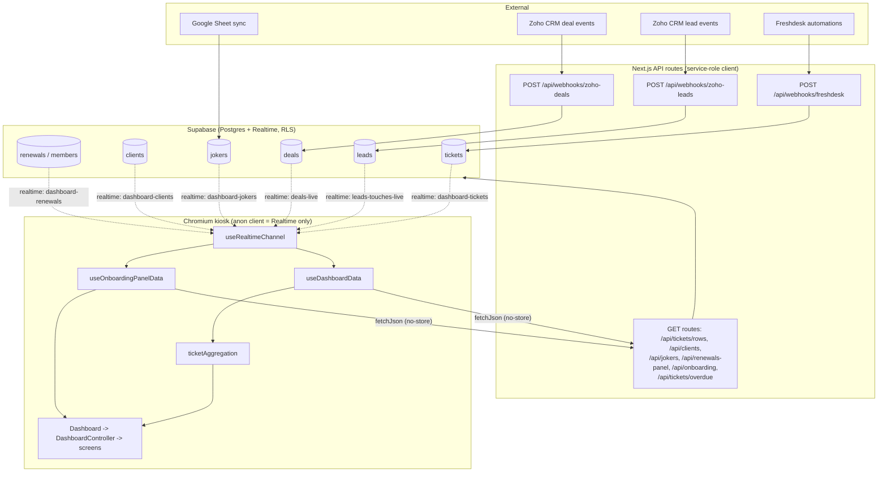
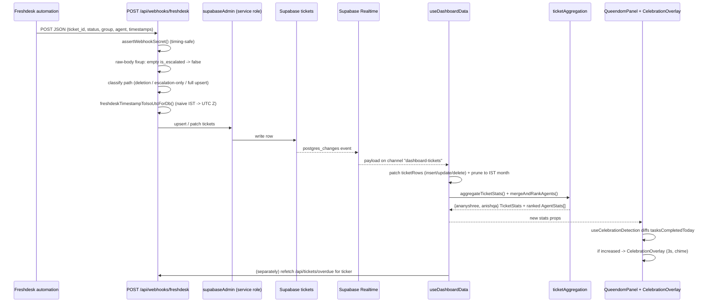
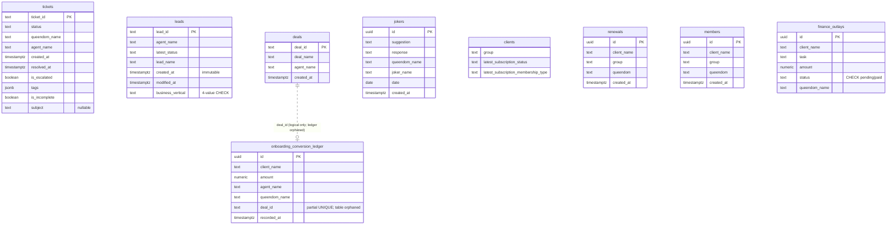

# Indulge Live Dashboard — Definitive Master Reference

> **Status:** Authoritative knowledge document. Synthesized from full source reads across 6 domains (entry/rotation, concierge, onboarding, shared lib, API/webhooks, DB/config/UI) plus the in-repo reference docs (`docs/master.md`, `docs/dry-audit.md`, `blueprint.md`, `CLAUDE.md`), and then independently fact-checked against the actual source files. Where docs and code disagreed, **code is treated as truth** (e.g., the Anishqa roster — see §5.2 and §10). Every claim is anchored to a file path relative to the repo root `/Users/alam/Desktop/Dashboard/Indulge-Dashboard`.
>
> **Audience:** an LLM (or engineer) with **no repo access** who must implement features, fix bugs, or refactor safely. The document is self-contained.

---

## Table of Contents

1. [Executive Summary](#1-executive-summary)
2. [High-Level Overview](#2-high-level-overview)
3. [Tech Stack & Dependencies](#3-tech-stack--dependencies)
4. [System Architecture](#4-system-architecture)
5. [Feature-by-Feature Analysis](#5-feature-by-feature-analysis)
6. [Database Schema](#6-database-schema)
7. [Things You MUST Know Before Changing Code](#7-things-you-must-know-before-changing-code)
8. [Technical Reference](#8-technical-reference)
9. [Glossary](#9-glossary)
10. [Open Questions & Assumptions](#10-open-questions--assumptions)

---

## 1. Executive Summary

**Indulge Live Dashboard** is a 24/7 real-time television broadcast instrument for **Indulge**, an Indian luxury concierge agency serving high-net-worth members across four business verticals (*Indulge Global*, *Indulge Shop*, *Indulge House*, *Indulge Legacy*).

- **What it is.** A fullscreen Next.js web app that runs on a 4K office TV in a Chromium kiosk. It displays live operational and revenue metrics as a cinematic, gold-on-obsidian "command center."
- **Domain.** Two intertwined business domains: (1) **Concierge operations** — support tickets handled by two competing teams called **Queendoms** (*Ananyshree* and *Anishqa*), sourced from **Freshdesk**; (2) **Revenue / Onboarding** — sales leads and deals from **Zoho CRM**, split into **Concierge (onboarding)** and **Shop** departments.
- **Target users.** Office staff and leadership watching the TV — passively. There is no operator: **no cursor, no scroll, no clicks** in normal use. The only inputs are a TV remote / keyboard for pause and manual screen switching (`hooks/useKeyboardControls.ts`).
- **How it runs.** Fullscreen at 4K. The app cycles between screens on a repeating timer (`components/DashboardController.tsx`, `lib/dashboardScreens.ts`). The rotation is a **loop**, not a linear sequence: **Concierge (60 s) → Revenue/Onboarding (10 s) → [Home (30 s) if enabled] → back to Concierge**. Screens crossfade over 1.5 s and never unmount. `html`/`body` have `overflow: hidden` (`app/globals.css`) so nothing scrolls.
- **How data arrives.** Push-based. External systems POST webhooks → Next.js API routes upsert into **Supabase** → the browser subscribes via **Supabase Realtime** and patches state within seconds. There are **no client-side calls to Freshdesk/Zoho**.

---

## 2. High-Level Overview

### 2.1 Features and their business purpose

| Feature | File(s) | Business purpose |
|---|---|---|
| **Concierge / Queendom screen** | `components/QueendomPanel.tsx` (×2, left/right) | Show each Queendom's live ticket health and agent standings to drive friendly competition and accountability. |
| **Ticket aggregation** | `lib/ticketAggregation.ts` | Convert raw ticket rows into the 5 hero metrics (Received / Resolved-Month / Resolved-Today / Pending / Joker) and per-agent stats — the numbers leadership trusts. |
| **Agent leaderboard** | `components/leaderboard/AgentLeaderboard.tsx`, `AgentRow.tsx`, `AgentIcon.tsx` | Rank agents by monthly completions; visible recognition + a daily-completion progress ring. |
| **Jokers strip** | `components/JokerMetricsStrip.tsx` | Track lifestyle "Joker" recommendation acceptance — a luxury upsell/engagement KPI per Queendom. |
| **Renewals panel** | `components/RenewalsPanel.tsx` | Surface membership renewals + newly assigned members this month (retention + growth signal). |
| **Overdue ticker** | `components/OverdueTicker.tsx` | Bottom marquee of SLA-breached (escalated) tickets — a constant nudge to clear overdue work. |
| **Special dates** | `components/SpecialDates.tsx`, `lib/specialDates.ts` | Client birthdays/anniversaries this month — prompts proactive concierge outreach. |
| **Celebration overlay** | `components/CelebrationOverlay.tsx`, `hooks/useCelebrationDetection.ts` | Full-screen gold celebration + chime when an agent completes a task — gamified morale. |
| **Revenue / Onboarding screen** | `components/onboarding/OnboardingLayout.tsx` and children | Sales performance for Concierge + Shop departments: agent scorecards, pipeline health, a vertical trendline, and a live closures ledger. |
| **Home panel (WIP)** | `components/HomePanel.tsx` | World clocks + a daily luxury quote — brand ambiance. Off in production. |
| **Screen rotation** | `components/DashboardController.tsx`, `lib/dashboardScreens.ts` | Time-shares the single TV across screens with cinematic crossfades; pause/skip via remote. |

### 2.2 How features interact

- **One data hook per screen.** `hooks/useDashboardData.ts` powers the Concierge screen (tickets, clients, jokers, renewals, overdue). `hooks/useOnboardingPanelData.ts` powers the Revenue screen (leads, deals, ledger, trendline). Both share `hooks/useRealtimeChannel.ts` (self-healing subscriptions) and `lib/clientFetch.ts` (`fetchJson`).
- **Tickets feed three features at once.** `useDashboardData` fetches `/api/tickets/rows` once; `lib/ticketAggregation.ts` derives the hero metrics **and** the leaderboard **and** drives celebration detection from the same rows.
- **Realtime events fan out.** A Freshdesk ticket change pushes on `dashboard-tickets` → patches rows → re-derives stats → may trigger a celebration. A Zoho deal pushes on `deals-live` → optimistic ledger prepend + pulse on the performance graph + a debounced `/api/onboarding` refetch.
- **Shared design system.** All screens use the same primitives (`components/ui/GlassPanel.tsx`, `StatCard.tsx`, `SectionDivider.tsx`, `ErrorBoundary.tsx`), motion presets (`lib/motionPresets.ts`), and IST date logic (`lib/istDate.ts`).

---

## 3. Tech Stack & Dependencies

### 3.1 Frameworks & libraries (`package.json`)

| Dependency | Version | Used for |
|---|---|---|
| `next` | ^16.1.6 | App Router framework; API routes + client app. `next.config.js` sets `reactStrictMode: true`, `turbopack.root: __dirname`. |
| `react` / `react-dom` | ^18 | UI runtime (no React 19). |
| `typescript` | dev | Strict typing; `tsconfig.json`: target ES2017, `strict: true`, `moduleResolution: bundler`, path alias `@/* → ./*`. |
| `@supabase/supabase-js` | ^2.39.0 | Supabase DB access + Realtime subscriptions (both clients). |
| `framer-motion` | ^11.0.0 | All entrance/crossfade/surge animations. |
| `tailwindcss` | ^3.4.0 | Styling; `tailwind.config.ts` extends the luxury-noir token set. |
| `postcss` + `autoprefixer` | dev | `postcss.config.js` standard Next.js chain. |
| `lucide-react` | ^0.363.0 | Icons (crown, gift, heart, alert, retry). |
| `react-clock` | ^6.0.0 | Analog clock faces on the Home panel. |
| `tsx` | dev | Runs `scripts/importTickets.ts`. |
| `csv-parser` | dev | CSV imports (`import_tickets.js`, `import_leads.js`). |

> **Dead/removed deps noted in `docs/dry-audit.md` (G2):** `date-fns` had zero imports; `csv-parser` was moved to `devDependencies`. All date math is hand-rolled in `lib/istDate.ts` — there is no third-party date library at runtime. Charts are hand-rolled SVG — there is **no** Recharts/Chart.js/D3.

### 3.2 Commands

```bash
npm run dev              # Next.js dev server
npm run build            # production build
npm run start            # production server (the TV target)
npm run lint             # next lint
npm run import-tickets   # one-off CSV ticket import (tsx scripts/importTickets.ts)
```
There is **no test framework** configured.

### 3.3 Environment variables

| Variable | Used by | Required | Notes |
|---|---|---|---|
| `NEXT_PUBLIC_SUPABASE_URL` | both Supabase clients (`lib/supabase.ts`, `lib/supabaseAdmin.ts`) | Yes | — |
| `NEXT_PUBLIC_SUPABASE_ANON_KEY` | browser client (`lib/supabase.ts`) | Yes | Realtime only. |
| `SUPABASE_SERVICE_ROLE_KEY` | `lib/supabaseAdmin.ts` | Yes | API routes return **503** if missing/placeholder. |
| `WEBHOOK_SECRET` | `lib/webhookAuth.ts` | Production: yes | **Fail-closed in production** (missing → 401 all webhooks); fail-open with a warning in dev. |
| `NEXT_PUBLIC_HOME_PANEL_ENABLED` | `lib/dashboardScreens.ts` | Optional | Set `"true"` to add the Home screen to rotation. Off in production. |
| `WEBHOOK_AUTH_DISABLED` | `lib/webhookAuth.ts` | Optional (dev) | Suppresses the dev missing-secret warning. |

> Also present in `.env.local` but used only by scripts/Cursor MCP tooling (never `NEXT_PUBLIC_`): `CHETTO_MCP_URL`, `CHETTO_MCP_BEARER_TOKEN`. Not consumed by the running app.

---

## 4. System Architecture

### 4.1 Push-based data flow

External systems never expose their data to the browser. They POST to Next.js webhook routes, which use the **service-role** Supabase client to upsert rows. Supabase Realtime then pushes change events to the browser's **anon** client, which patches in-memory state and recomputes derived metrics client-side. The GET API routes (also service-role) are used by the two hooks for the initial load and as a 5-minute safety-net poll.

*(Pre-rendered SVG: [`assets/architecture-flowchart.svg`](assets/architecture-flowchart.svg))*



### 4.2 End-to-end Freshdesk ticket event



### 4.3 Screen shell, rotation, and the two hooks

- **Entry point.** `app/page.tsx` renders `<Dashboard />`. `app/layout.tsx` sets fonts (Cinzel, Inter, Libre Baskerville, Montserrat via `next/font`; Edu hand-arrows via CSS), theme color `#050507`, and `overflow: hidden`.
- **Thin shell.** `components/Dashboard.tsx` calls `useDashboardData()` + `useCelebrationDetection()` and renders `TopBar`, `DashboardController`, `OverdueTicker`, `CelebrationOverlay` — each wrapped in `ErrorBoundary` so one crash cannot blank the TV.
- **Rotation state machine.** `components/DashboardController.tsx` holds `activeScreen` + `isFrozen`. A `setTimeout` of `SCREEN_DURATIONS_MS[activeScreen]` advances via `nextActiveScreen()` (`lib/dashboardScreens.ts`); no timer is armed when frozen. `ArrowLeft`/`ArrowRight` call `stepActiveScreen(current, ±1)`.
- **Always-mounted crossfade.** Each screen lives in a `ScreenLayer` `motion.div` animating only `opacity`/`zIndex`, with `visibility: hidden` applied via `transitionEnd` after the 1.5 s fade (`lib/motionPresets.ts` → `crossfadeTransition`). Screens **never unmount** (Invariant #12). Hidden layers receive `ScreenActivityContext = false` (`hooks/useScreenActive.ts`) so their internal clocks/rAF loops pause.
- **Two data hooks** (§5), both built on **`hooks/useRealtimeChannel.ts`**: subscribes a named channel to one or more tables, reads handlers through a ref (no stale closures), and on `CHANNEL_ERROR`/`TIMED_OUT` calls `onError` (refetch to heal missed events) then tears down and resubscribes after 3 s (`RECONNECT_DELAY_MS`, defined in `hooks/useRealtimeChannel.ts`). Cleanup always via `supabase.removeChannel`.

### 4.4 Cross-cutting concerns

- **Webhook auth** (`lib/webhookAuth.ts`). Accepts `x-webhook-secret` header, `Authorization: Bearer`, or `?secret=` query param; compared with `crypto.timingSafeEqual`. Production requires `WEBHOOK_SECRET` (else 401). The `?secret=` path is a documented anti-pattern pending config confirmation (`docs/dry-audit.md` E5).
- **RLS.** Every table: `anon` → SELECT only (for TV + Realtime); `authenticated` → ALL; `service_role` bypasses RLS (webhooks/imports). Policy names follow `{table}_select_anon`, `{table}_all_authenticated`.
- **Two Supabase clients.** `lib/supabase.ts` (anon, browser) is **Realtime-only**; `lib/supabaseAdmin.ts` (service role, cached on `globalThis.__supabaseAdmin__`, guarded by `requireSupabaseAdminOr503()`) is used by **all** API routes. Both are module-level singletons (Invariants #7, #8).
- **IST timezone** (`lib/istDate.ts`, `IST_OFFSET = "+05:30"`). Naive wall-clock strings are interpreted as **Asia/Kolkata**, not UTC. `istToday()`, `getCurrentIstMonthUtcBounds()`, `getCurrentIstDayUtcBounds()` drive all cohort math; `timestampStringToIsoUtcForDb()` (alias `freshdeskTimestampToIsoUtcForDb`) normalizes to UTC `Z` for storage; `normalizeZohoCrmTimestampForIstDigits()` strips false `Z`/`+00` suffixes Zoho appends to IST digits.
- **Caching/polling.** All GET routes return `Cache-Control: no-store` via `lib/apiGuard.ts` (`noStoreJson`, `withApiGuard`). Both hooks poll every 5 minutes as a safety net and prune at IST month rollover. `lib/clientFetch.ts fetchJson` returns `null` on any failure (TV keeps last good state).
- **Error boundaries.** `components/ui/ErrorBoundary.tsx` renders a quiet "◈ [LABEL] OFFLINE ◈" + retry fallback (no red, no stack traces) so a single widget crash looks like deliberate maintenance.

---

## 5. Feature-by-Feature Analysis

### 5.1 Concierge / Queendom screen

- **Business need.** Live competitive scoreboard for the two concierge teams.
- **Entry / UI.** `concierge` screen → two `components/QueendomPanel.tsx` (Ananyshree left, Anishqa right) with a center gold separator, mounted by `components/DashboardController.tsx`.
- **Layout (top→bottom).** `QueendomWingspanHeader` (member counts) → 5-metric hero row (`MetricBox` × 5) → `RenewalsPanel` → glass card with `AgentLeaderboard` (left) + `SpecialDates` (right, height-synced via `ResizeObserver`) → `JokerMetricsStrip`.
- **Services.** Props (`QueenStats`) come from `hooks/useDashboardData.ts`. Selectors are memoized so streaming Realtime patches don't cascade re-renders.
- **DB tables.** `tickets`, `clients`, `jokers`, `renewals`, `members`.
- **Side effects.** None outward (read-only screen); reacts to four Realtime channels.
- **Edge cases.** `queendomItemVariants` (opacity-only, 0.6 s / 0.09 stagger) are **intentionally different** from `lib/motionPresets.ts itemVariants` (fade-up 28 px, 0.7 s / 0.14 stagger) — do not unify (dry-audit B2). `SPECIAL_DATES_COL_WIDTH_CLASS` is a single source shared with `components/skeletons/QueendomSkeleton.tsx` for pixel-stable loading.

### 5.2 Ticket aggregation

- **Business need.** All ticket KPIs and agent stats, recomputed in the browser on every Realtime patch (no server round-trip).
- **Entry.** `lib/ticketAggregation.ts` consumes `TicketRowMinimal[]` from `/api/tickets/rows`.
- **Functions.** `aggregateTicketStats(rows)` → `{ananyshree, anishqa}` `TicketStats`; `aggregateAgentStats` / `mergeAndRankAgents(rows)` → ranked `AgentStats[]`; `pruneTicketRowsForDashboardState(rows)` keeps current IST month, caps at `MAX_TICKET_ROWS_IN_DASHBOARD_STATE = 5000`, newest first.
- **Cohort math (anchored to `created_at`, IST).** Received = created this month, not void. Resolved (Month) = created this month **and** now terminal. Solved Today = created today **and** terminal. **Pending = created this month and non-terminal — month-gated** (dry-audit D2). Per-agent: `overdueCount` = pending ∧ `is_escalated`; `incomplete` = `is_incomplete` ∧ status ∈ `INCOMPLETE_SCORE_STATUSES`.
- **Status sets.** Imported only from `lib/ticketStatus.ts`: `VOID = {spam, deleted}` (stripped first, always), `TERMINAL = {resolved, closed}`, `INCOMPLETE_SCORE = {nudge client, nudge vendor, ongoing delivery, invoice due}`. Names matched case-insensitively; rows deduped by id; void filtered before any math.
- **Roster.** `lib/agentRoster.ts` — **Ananyshree (9):** Sanika Ahire, Sakshi Bhutkar, Poorti Gulati, Anshika Eark, Ajith Sajan, Khushi Shah, Palak Kataria, Athul Jose, Ritika Jain. **Anishqa (10):** Sagar Ali, **Neha Sah**, Pranav Gadekar, Dhanush K, Charlotte Dias, Ria Pujhari, Rupali Chodankar, Eeti Srinivsulu, Ekta Nihalani, Rutika Kale. *(Verified from source; the `docs/master.md` digest's "Savio Francis Fernandes" is stale — recent commit `2e6cf63 neha addtion` replaced that seat. A name not in this roster silently zeroes that agent's stats.)*
- **Edge case.** All inputs are assumed already month-scoped by `pruneTicketRowsForDashboardState`; `calcAgent` does **not** re-filter by month.

### 5.3 Agent leaderboard

- **Business need.** Visible ranking + daily progress.
- **Entry.** `components/leaderboard/AgentLeaderboard.tsx` → `AgentRow.tsx` (memoized) → `AgentIcon.tsx`.
- **Columns.** Ring + crown (rank 1) | name | `completedToday/assignedToday` | `completedThisMonth/assignedThisMonth` | `pending / overdue / incomplete`. Ranking: `tasksCompletedThisMonth` DESC, then `tasksCompletedToday` DESC.
- **Ring.** `AgentIcon` SVG ring fill = `tasksCompletedToday / tasksAssignedToday`, animates `strokeDashoffset` 1.2 s.
- **Surge & win.** Surge flash (gold burst + shimmer) fires on increase of `tasksCompletedToday`/`pendingScore`, **suppressed for the first 1.5 s after mount** to avoid the initial 0→N WebSocket population flashing. `celebrationAgent` (case-insensitive match) drives a continuous win shimmer on rank 1.
- **DB columns.** `is_escalated`, `is_incomplete` on `tickets`.

### 5.4 Jokers strip

- **Business need.** Track luxury "Joker" lifestyle recommendation acceptance per Queendom.
- **Entry.** `components/JokerMetricsStrip.tsx` (compact mode sits inside the leaderboard glass card).
- **Metrics.** Recommendations (unique suggestions), Responses (`accepted / total`), Acceptance Rate = `accepted / (accepted + rejected) × 100` (0 when none decided).
- **Service.** `GET /api/jokers` aggregates the `jokers` table for the current IST month per Queendom; row month = `date` if set, else `created_at`.
- **DB table.** `jokers` (Google-Sheet-synced; columns include `suggestion`, `response`, `queendom_name`, `joker_name`). **Jokers:** Lilian Albrecht → ananyshree; Shruti Sharma → anishqa (`lib/agentRoster.ts JOKER_ROSTER`).
- **Edge case.** Unique-suggestion counting is case-insensitive + trimmed.

### 5.5 Renewals panel

- **Business need.** Retention (renewals) + growth (new member assignments) this month.
- **Entry.** `components/RenewalsPanel.tsx`, fed by `GET /api/renewals-panel?queendom=…`.
- **Shape.** `RenewalsPanelData = {totalRenewalsThisMonth, renewals[], assignments[]}`. First item in each list gets a celebration shimmer; empty → `—`.
- **DB tables.** `renewals` and `members` (same shape: `client_name`, `group`, `queendom`, `created_at`). `MONTH_ROW_CAP = 2000`.
- **Side effect.** `dashboard-renewals` channel refetches both queendoms on INSERT to `renewals` **or** `members`.

### 5.6 Overdue ticker

- **Business need.** Always-visible pressure to clear SLA-breached work.
- **Entry.** `components/OverdueTicker.tsx`, fed by `GET /api/tickets/overdue` → `OverdueTicketItem[] {id, subject, agentName}`.
- **Behavior.** CSS-animation marquee (`ticker-scroll`), 40 s baseline; `repeatsPerHalf(count) = max(1, ceil(10/count))` so the list spans 4K; pauses on hover; mask-fade at edges. Each item: `⚠ [SUBJECT] · #[ID] · [AGENT]`.
- **DB.** Filters `is_escalated = true`, **no month-gate** (overdue tickets are often old), DESC, limit 30. Subject may be NULL on historical rows → falls back to `Ticket #<id>`.
- **Side effect.** Refreshed by the second handler on `dashboard-tickets` (dual-handler pattern).

### 5.7 Special dates

- **Business need.** Prompt proactive birthday/anniversary outreach.
- **Entry.** `components/SpecialDates.tsx` per Queendom; data from `lib/specialDates.ts` (`SPECIAL_DATES_RAW`, normalized to the current year via `new Date().getFullYear()`).
- **Behavior.** Filtered to current IST month; today highlighted (gold gradient); birthdays = gift icon, anniversaries = rose heart; expired members muted. Recomputes at IST midnight via `getCurrentIstDayUtcBounds()`; lexicographic `YYYY-MM-DD` comparisons.
- **Edge case.** Data is a **static June-2026 snapshot**; there is no CSV reload mechanism. Year normalization keeps months aligned but the dataset itself does not refresh — it will drift over multi-year uptime. The midnight timeout is cleared on unmount.

### 5.8 Celebration overlay

- **Business need.** Gamified morale boost on task completion.
- **Entry.** `hooks/useCelebrationDetection.ts` (in `Dashboard.tsx`) → `components/CelebrationOverlay.tsx`.
- **Detection.** Compares each render's `tasksCompletedToday` against `prevScoresRef`. The ref is **seeded silently on first render** with the current (often zero) scores so nothing fires at startup — this seeding is the mechanism behind the "no flash on initial WebSocket population." First agent to increase wins; one overlay at a time (`!celebrationAgent` guard). The `celebrationAgent` dep is intentionally excluded from the effect deps to avoid a feedback loop.
- **Overlay.** 3000 ms fixed; agent initials avatar + name + 12 gold-dust particles (transform-only); 3-note chime via a **module-level singleton `AudioContext`** (Chromium caps ~6; per-celebration contexts would leak — dry-audit H1). Reduced-motion → tween instead of spring.

### 5.9 Revenue / Onboarding screen

- **Business need.** Sales performance for **Concierge (onboarding)** and **Shop** departments.
- **Entry.** `onboarding` screen → `components/onboarding/OnboardingLayout.tsx`, fed by `hooks/useOnboardingPanelData.ts` (`GET /api/onboarding`).
- **3-column grid.** Left `DepartmentColumn` (Concierge: Amit, Meghana, Samson, Kaniisha) | center (4 stat tiles + `PerformanceLineGraph` + `ConversionLedger`) | right `DepartmentColumn` (Shop: Vikram, Katya, Harsh, sky-themed).
- **Agent cards.** `CompactAgentCard` (portrait 40% + data 60%; container-query font scaling) shows leads-month, leads-today, closures, and a `LeadStatusHealthBar`. Portrait order: `agent.photoUrl` → bundled webp (`onboarding-agents-images/`) → dicebear. Department is derived at runtime from the agent's first name (`lib/onboardingAgents.ts getAgentDepartment`), defaulting to `concierge` when the name does not match any `shop` agent — **there is no department DB column**.
- **Leads & deals.**
  - **Leads** (`leads` table): metric tiles = Leads (all month rows), Attended (status ∈ Touched/In Discussion/Nurturing), Converted (deals count this month), Junk (remainder). Zoho's `attempted` is normalized to **Touched**.
  - **Deals** (`deals` table): append-only; powers closures + the ledger.
- **Conversion ledger.** `components/onboarding/ConversionLedger.tsx` — rAF pixel ticker (not CSS keyframes), `dt` capped 100 ms, seamless clone block, max `LIVE_LEDGER_MAX = 15`, scroll `max(32, n×6)` s. New row prepend offsets `posRef` by one average row height so visible rows stay put. Pauses via `useScreenActive()` when hidden. **Sourced from the `deals` table** (`app/api/onboarding/route.ts` reads `.from("deals")`), and **no ₹ amount is displayed**. The `onboarding_conversion_ledger` table is *not* the source — it is orphaned (see §6/§7.6/§10).
- **Performance graph.** `PerformanceLineGraph.tsx` — 460×248 SVG; 4 Catmull-Rom lines (tension 0.35), one per business vertical, drawn up to today only; `PulseEvent {id, team}` fires a surge + bloom + rings + spark + 6 stardust particles, auto-clears after 2.3 s.
- **Lead status health bar.** `LeadStatusHealthBar.tsx` — 6 Zoho statuses ordered Qualified→In Discussion→Nurturing→Touched→New→Junk; segments animate width (80 ms stagger); labels only if segment ≥ 5% width.
- **Side effects.** `deals-live` (INSERT → ledger prepend + `firePulse` + 2.5 s debounced refetch) and `leads-touches-live` (INSERT → pulse + debounced refetch). Overlapping loads use `AbortController`.
- **Resilience.** `/api/onboarding` returns an empty 200 (zeroed) on DB error; fallback zeroed agents fill all 6 seats so the TV never shows missing agents.

### 5.10 Home panel (WIP)

- **Business need.** Brand ambiance between operational screens.
- **Entry.** `components/HomePanel.tsx`, gated by `NEXT_PUBLIC_HOME_PANEL_ENABLED` (off in prod) via `lib/dashboardScreens.ts`.
- **Content.** 4 analog+digital world clocks (Mumbai/London/NYC/Dubai) driven by a single 1 s interval (paused when hidden) + a daily luxury quote indexed by `istToday().day`. Formatters cached in `Map`s to save TV CPU.

### 5.11 Screen rotation

- **Business need.** Time-share one TV across multiple dashboards.
- **Entry.** `components/DashboardController.tsx` + `lib/dashboardScreens.ts` (`ACTIVE_SCREEN_ORDER`, `SCREEN_DURATIONS_MS` = concierge 60 000 ms / onboarding 10 000 ms / home 30 000 ms, `nextActiveScreen`, `stepActiveScreen`, `HOME_PANEL_ENABLED`).
- **Controls.** `hooks/useKeyboardControls.ts` — capture-phase `keydown`: P/Space/Enter/NumpadEnter/MediaPlayPause toggle freeze; arrows step screens (work even while frozen). On-screen PAUSE/RESUME button ≥140×48 px for remote accuracy.
- **Edge cases.** When frozen, no rotation timer is armed. Even with `home` disabled, `SCREEN_DURATIONS_MS.home` exists but is never reached (the order array excludes it).

---

## 6. Database Schema

All tables in schema `public`; all in the `supabase_realtime` publication; uniform RLS (`anon` SELECT, `authenticated` ALL, `service_role` bypass). Migrations in `supabase/migrations/` (19 files, `20250318000000` → `20260613000000`). Relationships below are **logical, not enforced foreign keys**.

| Table | PK | Key columns | Realtime | Canonical vs legacy |
|---|---|---|---|---|
| `tickets` | `ticket_id` | `status`, `queendom_name`, `agent_name`, `created_at`, `resolved_at`, `is_escalated` (bool), `tags` (jsonb), `is_incomplete` (bool), `subject` (text, nullable) | Yes | — (soft-delete only; `status='deleted'`) |
| `leads` | `lead_id` | `agent_name`, `latest_status`, `lead_name`, `created_at` (immutable), `modified_at`, `business_vertical` (4-value CHECK, default `Indulge Global`) | Yes | renamed from `onboarding_lead_touches` (2026-04-25) |
| `deals` | `deal_id` | `deal_name`, `agent_name`, `created_at` | Yes | renamed from `onboarding_deals` (2026-04-25) |
| `jokers` | `id` (uuid) | `client_name`, `city`, `date`, `type`, `suggestion`, `response`, `queendom_name`, `joker_name`, `created_at` | Yes | — |
| `clients` | — | `group`, `latest_subscription_status` (Active/Expired), `latest_subscription_membership_type` (Premium/Genie/Monthly Trial/Standard = paid; Celebrity = complimentary) | Yes | — |
| `renewals` | `id` (uuid) | `client_name`, `group`, `queendom`, `created_at` | Yes | seeded 2025-03-18 (Ananyshree + Anishqa) |
| `members` | `id` (uuid) | same shape as `renewals` | Yes | — |
| `finance_outlays` | `id` (uuid) | `client_name`, `task`, `amount` NUMERIC(14,2), `status` (CHECK pending/paid), `queendom_name`, `created_at`, `updated_at`; idx `(queendom_name, status)` | Yes | consumed only by unmounted `ActiveOutlays`/`OutlayLedger` |
| `onboarding_conversion_ledger` | `id` (uuid) | `client_name`, `amount` NUMERIC(14,2), `agent_name`, `queendom_name` (default `''`), `recorded_at`, `created_at`, `deal_id` (text, partial UNIQUE idx where not null) | Yes | **Orphaned** — no code reads or writes it; the ledger UI reads the `deals` table instead (dry-audit G4, drop/archive decision pending) |

> **Verification note.** The `onboarding_conversion_ledger.deal_id` column is real: it was added by `supabase/migrations/20250409120000_onboarding_conversion_ledger_deal_id.sql` (text column + partial unique index) to deduplicate Zoho deal webhooks. The table itself is nonetheless orphaned — `app/api/onboarding/route.ts` reads `.from("deals")` (lines ~188/367/395), **not** this table. The route header comment at `app/api/onboarding/route.ts:15` still references `onboarding_conversion_ledger.{recorded_at, amount}` and is **stale/misleading** — trust the code, not the comment.



> **Logical relationships (no DB FKs):** `tickets.queendom_name` and `renewals/members/jokers/clients/finance_outlays.queendom_name`/`group` all map to a Queendom via `normalizeQueendom()` (`.includes()` on a lowercased string). `leads.agent_name`/`deals.agent_name` map to a department via `getAgentDepartment()`. `onboarding_conversion_ledger.deal_id` would logically point at `deals.deal_id`, but the table is dead so the link is inert.

---

## 7. Things You MUST Know Before Changing Code

### 7.1 The critical invariants (intent preserved; from `CLAUDE.md`)

> There are **12** invariants. (`CLAUDE.md` narrates "11" in places but enumerates 12 numbered rules; the full enumerated list is authoritative and reproduced here.) Violating any of these causes **silently wrong metrics on the TV**.

1. **IST everywhere.** Never `new Date().toISOString().slice(0,10)`. Use `lib/istDate.ts`.
2. **Void tickets stripped first.** `spam`/`deleted` never count anywhere — the first step of every aggregation (`lib/ticketAggregation.ts`).
3. **Terminal = {resolved, closed} only.** Void ≠ terminal. Sets live in `lib/ticketStatus.ts`; never redefine locally.
4. **Cohort math anchored to `created_at`.** "Resolved This Month" = created this IST month and now terminal — not "resolved this month."
5. **`is_escalated=true` only via the escalation-only webhook path** (`app/api/webhooks/freshdesk/route.ts`); the full-upsert path omits the field for active non-SLA-safe statuses (preserves the DB value).
6. **Freshdesk timestamps via `freshdeskTimestampToIsoUtcForDb()`** before storage, or Postgres shifts naive IST by +5:30.
7. **Anon client = Realtime only.** All fetching via API routes + service role.
8. **Supabase clients are module-level singletons.** Never `createClient` in a component/hook.
9. **Queendom matching via `.includes()`**, never equality (`lib/queendom.ts`).
10. **Postgres `23505` (PK violation) on `leads.lead_id`/`deals.deal_id` insert = expected dedup**, silently ignore.
11. **Soft-delete only for tickets.** Deletion sets `status='deleted'` (and `is_escalated=false`); the VOID filter hides the row. Tickets are never `DELETE`d.
12. **All screens always mounted** during rotation — crossfade opacity/zIndex only; never unmount to "optimize."

### 7.2 Dry-audit decisions (`docs/dry-audit.md`)

- **D2 — month-gating:** every dashboard metric (incl. Pending) counts only tickets created in the current IST month; `/api/tickets/rows` month-gates and the client prune re-enforces it. Do not re-add an "all open tickets ever" path.
- **C2 — shared channel + reconnect:** both hooks use `hooks/useRealtimeChannel.ts`; `useDashboardData` previously lacked the 5-min refetch + 3 s reconnect — don't remove it. Channel names (`dashboard-*`, `deals-live`, `leads-touches-live`) are contractual — never rename them.
- **G1:** `/api/tickets` (server-side aggregation) and `/api/agents` were deleted (no callers, 2026-06-11). `/api/tickets/rows` + client aggregation is the only ticket path.
- **H3/H4 — hidden-layer power management:** `useScreenActive()` pauses `ConversionLedger`'s rAF and `HomePanel`'s clock while hidden; `TopBar`'s per-second tick is isolated in `LiveTimeText`. Resume is seamless because state lives in refs.
- **H1:** module-level singleton `AudioContext` in `CelebrationOverlay` (Chromium caps ~6 contexts).
- **G4 (open):** `onboarding_conversion_ledger` is orphaned; drop/archive pending human approval.
- **B2:** `QueendomPanel`'s `queendom*` motion variants intentionally differ from `motionPresets` — do not unify.
- **E5 (open):** the `?secret=` webhook query-param auth path is an anti-pattern; removal blocked pending confirmation that Freshdesk/Zoho configs don't use it.

### 7.3 Performance optimizations

- **GPU promotion.** `gpuStyle` (`willChange: transform, opacity; transform: translateZ(0)`) on every animated element; hidden layers get `visibility: hidden` to leave the paint path.
- **Animate only opacity/transform** in JS; color/shadow breathing only via CSS `@keyframes`. No `backdrop-blur` on moving TV elements.
- **Charts are native SVG only** (no Recharts/Chart.js/D3).
- **Row caps:** tickets 5000 (`MAX_TICKET_ROWS_IN_DASHBOARD_STATE`), ledger 15 (`LIVE_LEDGER_MAX`), renewals/members 2000 (`MONTH_ROW_CAP`).
- **Memoization:** `QueendomPanel` selectors, `AgentRow`/`AgentIcon` `memo`, `OverdueTicker` `tickerItemPropsAreEqual`.

### 7.4 Hardcoded business rules

- Rosters in `lib/agentRoster.ts` (Ananyshree 9, Anishqa 10) and onboarding cards in `lib/onboardingAgents.ts`. **A name not present silently zeroes that agent's stats** — there is no error.
- **Queendom matching** (`lib/queendom.ts normalizeQueendom`): lowercases + trims, then `.includes("ananyshree")` / `.includes("anishqa")`, returning `null` if neither is found. This is why a raw Freshdesk group like `"Team Ananyshree"` resolves to `"ananyshree"` — equality matching would drop every decorated name.
- **Department** by first-name lookup (`lib/onboardingAgents.ts`, `getAgentDepartment`/`DEPARTMENT_BY_AGENT_KEY`), defaulting to `concierge` when no `shop` agent matches.
- Paid membership types = Premium / Genie / Monthly Trial / Standard; Celebrity = complimentary (`/api/clients`).
- 4 business verticals enforced by CHECK on `leads.business_vertical`; invalid → defaults to `Indulge Global`.

### 7.5 Security implications

- `WEBHOOK_SECRET` is **fail-closed in production** (missing → 401); the `?secret=` query-param path leaks the secret into request logs (dry-audit E5).
- The anon key is shipped to the browser but RLS limits it to SELECT; never use it for writes.
- The service-role key must never reach the client; it bypasses RLS entirely.

### 7.6 Tricky / counterintuitive code

- **Freshdesk raw-body fixup:** the route regex-replaces empty `"is_escalated":` with `false` **before** `JSON.parse`, because Freshdesk merge templates emit unset variables as empty strings (would otherwise be invalid JSON).
- **Immutable `leads.created_at`:** zoho-leads uses select→update/insert (not a blind upsert) to preserve the cohort anchor; a `23505` race retries as an update.
- **Surge suppression window:** the 1.5 s post-mount guard prevents the initial WebSocket 0→N population from flashing the leaderboard.
- **Overdue is NOT month-gated**, unlike every other metric.
- **`onboarding_conversion_ledger` looks like the ledger source but is dead** — the UI reads `deals`. The route's own header comment (`app/api/onboarding/route.ts:15`) is stale and points at the orphaned table; ignore it.

---

## 8. Technical Reference

### 8.1 Per-directory file index (selected, load-bearing)

| Path | Role | Key symbols |
|---|---|---|
| `app/page.tsx` | Root entry | `Page()` → `<Dashboard/>` |
| `app/layout.tsx` | Root layout, fonts, viewport | `RootLayout`, Cinzel/Inter/Baskerville/Montserrat |
| `components/Dashboard.tsx` | Thin shell | composes `useDashboardData`, `useCelebrationDetection` |
| `components/DashboardController.tsx` | Rotation state machine | `ScreenLayer`, `screenFadeAnimate`, `useKeyboardControls` |
| `components/TopBar.tsx` | Header + live IST clock | `LiveTimeText`, IST formatters |
| `components/QueendomPanel.tsx` | Concierge panel | `MetricBox`, `queendomItemVariants`, `SPECIAL_DATES_COL_WIDTH_CLASS` |
| `components/QueendomWingspanHeader.tsx` | Member-count header | `MetricPill` |
| `components/leaderboard/*` | Leaderboard | `AgentLeaderboard`, `AgentRow`, `AgentIcon` |
| `components/JokerMetricsStrip.tsx` | Joker stats | `JokerMetricBox`, `acceptancePct` |
| `components/RenewalsPanel.tsx` | Renewals + assignments | `NameRow` |
| `components/OverdueTicker.tsx` | Marquee | `TickerItem`, `repeatsPerHalf`, `MIN_ITEMS_PER_HALF` |
| `components/SpecialDates.tsx` | Birthdays/anniversaries | `isToday`, `isCurrentMonth`, IST midnight tick |
| `components/CelebrationOverlay.tsx` | Win overlay | `sharedAudioCtx`, `playSuccessSound`, `GoldDustParticles` |
| `components/HomePanel.tsx` | WIP clocks + quote | `ClockCard`, `DAILY_QUOTES` |
| `components/onboarding/OnboardingLayout.tsx` | Revenue layout | 3-col grid |
| `components/onboarding/DepartmentColumn.tsx` | Agent column | `CompactAgentCard`, `ACCENTS` |
| `components/onboarding/LeadStatusHealthBar.tsx` | Pipeline bar | `STATUS_COLORS` |
| `components/onboarding/PerformanceLineGraph.tsx` | SVG trendline | `VERTICAL_COLORS`, `smoothPath`, `PulseEvent` |
| `components/onboarding/ConversionLedger.tsx` | rAF ledger | `posRef`, `primaryHRef`, `formatLedgerDate` |
| `components/onboarding/utils.ts` | Onboarding helpers | `LIVE_LEDGER_MAX`, `orderConciergeAgentsForDisplay`, `ledgerRowFromInsertPayload` |
| `components/ui/{GlassPanel,GoldGlassCard,StatCard,SectionDivider,ErrorBoundary}.tsx` | UI primitives | design-system surfaces |
| `components/AnimatedCounter.tsx` / `AnimatedValue.tsx` | Numeric animation | spring count-up / scale-pop |
| `components/skeletons/{QueendomSkeleton,OnboardingSkeleton,Sk}.tsx` | Loading mirrors | `Sk` |
| `components/_unmounted/*` | Parked widgets | `ActiveOutlays`, `OutlayLedger`, `LeadVelocityChart`, `AgentVerticalBarChart`, `finance-utils.ts` |
| `hooks/useDashboardData.ts` | Concierge state | 6 fetchers, 4 channels |
| `hooks/useOnboardingPanelData.ts` | Revenue state | `firePulse`, 2 channels |
| `hooks/useRealtimeChannel.ts` | Shared subscription | `RealtimeTableConfig`, `RECONNECT_DELAY_MS` |
| `hooks/{useCelebrationDetection,useKeyboardControls,useScreenActive,usePrefersReducedMotion,usePrevious,usePulseOnChange}.ts` | Behavior hooks | — |
| `lib/istDate.ts` | IST date logic | `istToday`, `getCurrentIstMonthUtcBounds`, `getCurrentIstDayUtcBounds`, `timestampStringToIsoUtcForDb`/`freshdeskTimestampToIsoUtcForDb`, `normalizeZohoCrmTimestampForIstDigits` |
| `lib/ticketStatus.ts` | Status sets | `VOID/TERMINAL/INCOMPLETE_SCORE/SLA_SAFE/ACTIVE_CLEAR_RESOLVED_AT`, `isVoid`, `isTerminal` |
| `lib/ticketAggregation.ts` | Ticket math | `aggregateTicketStats`, `mergeAndRankAgents`, `pruneTicketRowsForDashboardState` |
| `lib/queendom.ts` | Queendom matcher | `normalizeQueendom` |
| `lib/agentRoster.ts` | Rosters + jokers | `ROSTER_*`, `JOKER_ROSTER`, `buildRoster` |
| `lib/onboardingAgents.ts` | Onboarding roster | `getAgentDepartment`, `onboardingAgentNameMatches`, `CONCIERGE/SHOP_AGENT_CARDS` |
| `lib/{supabase,supabaseAdmin}.ts` | Clients | `supabase`, `supabaseAdmin`, `requireSupabaseAdminOr503` |
| `lib/{apiGuard,webhookAuth,webhookGuard,zohoWebhook,clientFetch,db}.ts` | Server/client plumbing | `withApiGuard`/`noStoreJson`, `assertWebhookSecret`, `withWebhookGuard`, `readZohoWebhookBody`, `fetchJson`, `paginateAll` |
| `lib/{motionPresets,format,dashboardScreens,dataSources,widgetRegistry}.ts` | Shared utils | presets, `getInitials/safeNum`, screen config, integration registry |
| `lib/{types,onboardingTypes}.ts`, `types/index.ts` | Types | `QueenStats`, `TicketStats`, `AgentStats`, `OnboardingApiPayload`, `ActiveScreen`, `QueendomId` |
| `scripts/importTickets.ts`, `import_tickets.js`, `import_leads.js` | One-off CSV imports | batch upsert |

### 8.2 Internal API surface

All GET routes: service-role client, `Cache-Control: no-store`. All webhooks: `assertWebhookSecret` first.

| Method · Path | Query / Body | Response | Auth |
|---|---|---|---|
| GET `/api/tickets/rows` | — | `TicketRowMinimal[]` (`{id, status, queendom_name, agent_name, created_at, is_escalated, is_incomplete, tags}`), current IST month only | none |
| GET `/api/tickets/overdue` | — | `OverdueTicketItem[]` (`{id, subject, agentName}`), `is_escalated=true`, no month-gate, ≤30; empty 200 on error | none |
| GET `/api/clients` | — | `{ananyshree: MemberStats, anishqa: MemberStats}` | none |
| GET `/api/jokers` | — | `{ananyshree: JokerStats, anishqa: JokerStats}`, IST month; empty 200 on error | none |
| GET `/api/renewals-panel` | `?queendom=ananyshree\|anishqa` | `{totalRenewalsThisMonth, renewals[], assignments[]}` | none |
| GET `/api/onboarding` | — | `OnboardingApiPayload` (`agents[], ledger[], departments, leadStatusByAgent, verticalTrendline, leadMonthStats`); empty 200 on error | none |
| POST `/api/webhooks/freshdesk` | JSON ticket event | `{ok:true}` | secret |
| POST `/api/webhooks/zoho-leads` | JSON / form-urlencoded lead | `{ok:true}` | secret |
| POST `/api/webhooks/zoho-deals` | JSON / form-urlencoded deal | `{ok:true}` or `{ok:true, action:'ignored', reason:'duplicate_deal'}` | secret |
| POST `/api/webhooks/zoho-calls` | — | **Not implemented** (README scaffold only) | — |

**Example — Freshdesk full upsert:**
```http
POST /api/webhooks/freshdesk
x-webhook-secret: <WEBHOOK_SECRET>
Content-Type: application/json

{ "ticket_id": 12345, "status": "resolved", "group": "Team Ananyshree",
  "agent_name": "Sakshi Bhutkar", "created_at": "2026-06-19 14:30:00" }
```
The route classifies this as a full upsert (status + group present), normalizes `created_at` as naive IST → UTC, sets `resolved_at`, and clears `is_escalated` (terminal is SLA-safe).

### 8.3 External integrations (`lib/dataSources.ts`)

| Source | `id` | Webhook path | Table | Realtime channel | Implemented |
|---|---|---|---|---|---|
| Freshdesk | `freshdesk` | `/api/webhooks/freshdesk` | `tickets` | `dashboard-tickets` | yes |
| Zoho CRM leads | `zoho-leads` | `/api/webhooks/zoho-leads` | `leads` | `leads-touches-live` | yes |
| Zoho CRM deals | `zoho-deals` | `/api/webhooks/zoho-deals` | `deals` | `deals-live` | yes |
| Zoho CRM calls | `zoho-calls` | — | — | — | **no** |
| Google Sheet | (sync, no webhook) | — | `jokers` | `dashboard-jokers` | yes |

- **Freshdesk** sends naive-IST timestamps and decorated group names (`"Team Ananyshree"`). Three handler paths in `app/api/webhooks/freshdesk/route.ts`: deletion (soft-delete), escalation-only (only place `is_escalated=true` can be set), full upsert. Read the file's header comment before touching it.
- **Zoho CRM** appends false `Z`/`+00` to IST digits → stripped by `normalizeZohoCrmTimestampForIstDigits`. Leads use select-then-update/insert (immutable `created_at`); deals are append-only (dedup on `deal_id`, `23505` ignored).
- **Google Sheet → `jokers`** is synced externally (no webhook in this repo).

---

## 9. Glossary

- **Queendom** — one of two concierge teams: **Ananyshree** (9 agents) or **Anishqa** (10 agents). Matched from raw group strings via `.includes()` (`lib/queendom.ts`), so `"Team Ananyshree"` → `"ananyshree"`.
- **Ananyshree / Anishqa** — the two Queendom team names; also the keys (`QueendomId`) used throughout the codebase.
- **Joker** — a luxury lifestyle recommendation; tracked per Queendom (`jokers` table). Joker agents: Lilian Albrecht (ananyshree), Shruti Sharma (anishqa).
- **VOID statuses** — `spam`, `deleted`; stripped before all math; invisible on the TV.
- **TERMINAL statuses** — `resolved`, `closed`; genuine completions.
- **INCOMPLETE_SCORE statuses** — `nudge client`, `nudge vendor`, `ongoing delivery`, `invoice due`; with `is_incomplete=true` feed the leaderboard "incomplete" column.
- **SLA_SAFE statuses** — terminal + void + (nudge client / ongoing delivery / invoice due); on upsert `is_escalated` is forced false.
- **Cohort math** — metrics filtered by `created_at` within strict IST calendar-month bounds (not rolling 30 days, not UTC).
- **IST** — India Standard Time (Asia/Kolkata, UTC+5:30); the only timezone for "today"/"this month."
- **Escalation (`is_escalated`)** — SLA breach flag; only the escalation-only Freshdesk path can set it `true`.
- **Business vertical** — Indulge Global / Shop / House / Legacy (`leads.business_vertical`, 4-value CHECK).
- **Lead** — a Zoho CRM prospect (`leads` table); **Deal** — a Zoho CRM closure (`deals`, append-only).
- **Conversion ledger** — the scrolling closures list (`ConversionLedger.tsx`), sourced from the **`deals`** table (the `onboarding_conversion_ledger` table is orphaned).
- **Department** — `concierge` (onboarding) or `shop`; derived from agent first name at runtime, default `concierge`.
- **ScreenLayer / ScreenActivityContext** — always-mounted crossfade wrapper; `useScreenActive()` pauses hidden screens' clocks/rAF.
- **Soft-delete** — tickets are never `DELETE`d; `status='deleted'` hides them via the VOID filter.
- **Dry-audit code** — a decision marker (D2, C2, G1, H1/H3/H4, B2, G4, E5…) linking code comments to `docs/dry-audit.md`.

---

## 10. Open Questions & Assumptions

| Item | Confidence | Notes |
|---|---|---|
| **Anishqa roster includes "Neha Sah", not "Savio Francis Fernandes"** | High | Verified by reading `lib/agentRoster.ts`; commit `2e6cf63 neha addtion` confirms. `docs/master.md` is stale here. ⚠️ Re-confirm the live roster against the real team — a wrong name silently zeroes that agent's stats. |
| `onboarding_conversion_ledger` table | High (orphaned), open (decision) | No code reads/writes it; the ledger UI reads `deals`. The `deal_id` column **does** exist (migration `20250409120000`) but is inert. Drop/archive is a pending **human** decision (dry-audit G4). The route comment at `app/api/onboarding/route.ts:15` is stale and should be corrected to reference `deals`. |
| `?secret=` webhook query param | Medium | Documented anti-pattern; removal blocked until Freshdesk/Zoho configs are confirmed not to use it (dry-audit E5). |
| `/api/webhooks/zoho-calls` | High | Not implemented (README scaffold); `lib/dataSources.ts` marks `implemented: false`. |
| Home panel | High | Built but off in production (`NEXT_PUBLIC_HOME_PANEL_ENABLED`). |
| Unmounted widgets | High | `components/_unmounted/`: `ActiveOutlays`+`OutlayLedger` (finance; `finance_outlays` table is live in the DB), `LeadVelocityChart`, `AgentVerticalBarChart`. Fully built; wrap in `ErrorBoundary` when re-mounting; **do not delete** (`components/_unmounted/README.md`). |
| `specialDates` data | High | Static June-2026 snapshot in `lib/specialDates.ts`, normalized to current year; no reload mechanism — will drift over a multi-year uptime. |
| Exact PK/column SQL types in the ER diagram | Medium | Column **names** are verified against migration files + domain reads; precise SQL types (uuid vs text, nullability) should be confirmed against the SQL in `supabase/migrations/` before a destructive change. |
| Invariant count ("11" vs "12") | High | `CLAUDE.md` prose says "11" but enumerates 12 numbered rules. This doc lists all 12 (§7.1). Treat all 12 as binding. |

> **Note on a corrected claim:** an earlier synthesis draft listed `getLast30DaysUtcBounds`, `recordedAtToMillis`, and `isRecordedAtInInclusiveRange` as "dead helpers" in `lib/istDate.ts`. A direct check found these symbols are **not defined in `lib/istDate.ts` at all** (and have zero callers repo-wide) — they were a hallucination and have been removed from this document. Do not look for them.

---

This document is self-contained: a reader without repo access can understand the product, its data flow, every screen/feature, the schema, the invariants, and the open risks. The source code is the final authority; `docs/master.md` and `docs/dry-audit.md` are the living references this synthesis reconciles. All factual claims above were cross-checked against the actual source files during a dedicated verification pass.
